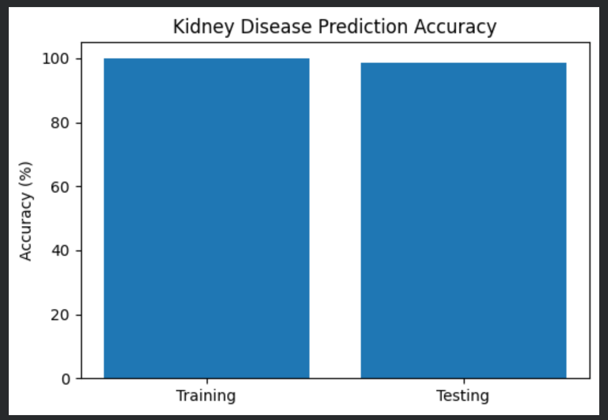

# Multi-Disease Prediction System Using Machine Learning

A machine-learning-based healthcare project developed during my **Data Science, AI & Machine Learning using Python internship at ASD**.

## Project Overview

This project explores the application of machine learning for predicting three different diseases using structured medical datasets:

* **Diabetes**
* **Heart Disease**
* **Chronic Kidney Disease**

Separate preprocessing and machine-learning pipelines were developed for each prediction task.

## Objectives

* Apply machine-learning techniques to healthcare datasets.
* Perform appropriate data preprocessing and feature preparation.
* Develop disease-specific classification models.
* Evaluate model performance using test data.
* Explore the potential of machine learning for data-driven healthcare prediction.

## Methodology

The overall workflow consists of:

```text
Medical Dataset
      ↓
Data Preprocessing
      ↓
Missing-Value / Feature Handling
      ↓
Feature Encoding & Scaling
      ↓
Train-Test Split
      ↓
Machine Learning Model
      ↓
Prediction
      ↓
Performance Evaluation
```

### Diabetes Prediction

A preprocessing pipeline was applied to the diabetes dataset, followed by feature scaling and classification using a **Support Vector Machine (SVM)** model.

### Heart Disease Prediction

The heart-disease dataset was preprocessed and evaluated using machine-learning classifiers, including **Logistic Regression and Random Forest**.

### Chronic Kidney Disease Prediction

The kidney-disease dataset was processed using missing-value handling and categorical feature encoding, followed by a **Random Forest** classification model.

## Model Performance

| Disease                | Model / Approach                    | Test Accuracy |
| ---------------------- | ----------------------------------- | ------------: |
| Diabetes               | SVM                                 |        77.27% |
| Heart Disease          | Random Forest / Logistic Regression |        88.52% |
| Chronic Kidney Disease | Random Forest                       |        98.75% |

*Reported performance is based on the test evaluations implemented in the project notebook.*

## Technologies Used

* Python
* Pandas
* NumPy
* Scikit-learn
* Matplotlib
* Google Colab
* Machine Learning

## Project Structure

```text
multi-disease-prediction-ml/
│
├── Multi_Disease_Prediction.ipynb
└── README.md
```

## Internship

**Organization:** ASD
**Role:** Data Science, AI & Machine Learning Intern
**Domain:** Data Science, AI & Machine Learning using Python
**Duration:** May 20, 2026 – August 20, 2026

## Note

This project is an academic/internship machine-learning project intended for educational and research purposes. The predictions should not be interpreted as clinical diagnoses.
## Prediction Results

### Diabetes Prediction


### Heart Disease Prediction


### Chronic Kidney Disease Prediction

## Methodology

The project follows separate machine-learning pipelines for each disease prediction task.

### 1. Diabetes Prediction

The diabetes dataset is prepared through data preprocessing and feature scaling. A Support Vector Machine (SVM) classifier is then trained and evaluated on the processed data.

**Pipeline:**

```text
Diabetes Dataset
       ↓
Data Preprocessing
       ↓
Feature Scaling
       ↓
Train-Test Split
       ↓
SVM Classifier
       ↓
Prediction & Evaluation
```

### 2. Heart Disease Prediction

The heart disease dataset is preprocessed and used to develop classification models. Logistic Regression and Random Forest approaches are considered for prediction and performance evaluation.

**Pipeline:**

```text
Heart Disease Dataset
       ↓
Data Preprocessing
       ↓
Feature Preparation
       ↓
Train-Test Split
       ↓
Classification Models
       ↓
Prediction & Evaluation
```

### 3. Chronic Kidney Disease Prediction

The kidney disease dataset undergoes missing-value handling and categorical feature encoding before model training. A Random Forest classifier is used for prediction.

**Pipeline:**

```text
Kidney Disease Dataset
       ↓
Missing-Value Handling
       ↓
Categorical Encoding
       ↓
Train-Test Split
       ↓
Random Forest
       ↓
Prediction & Evaluation
```

## Evaluation

The models are evaluated using test-set performance. The reported test accuracies are:

* **Diabetes:** 77.27%
* **Heart Disease:** 88.52%
* **Chronic Kidney Disease:** 98.75%

These values correspond to the evaluations implemented in the project notebook.
## Limitations

* The project evaluates machine-learning models on existing structured datasets and does not represent clinical validation.
* Model performance may depend on the characteristics, quality, and class distribution of the datasets used.
* Test accuracy alone does not provide a complete assessment of model performance, particularly for healthcare applications.

## Future Work

Possible extensions of this project include:

* Evaluating additional machine-learning and ensemble methods.
* Using additional evaluation metrics such as precision, recall, F1-score and ROC-AUC.
* Investigating feature selection and hyperparameter optimization to improve model performance.
* Evaluating the models on independent datasets to assess their generalizability.
* Exploring explainable AI techniques to better understand model predictions.
